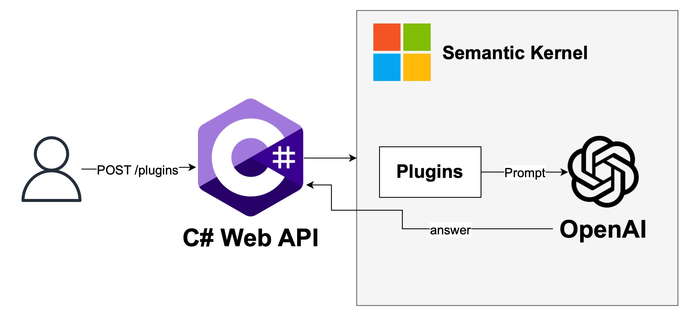
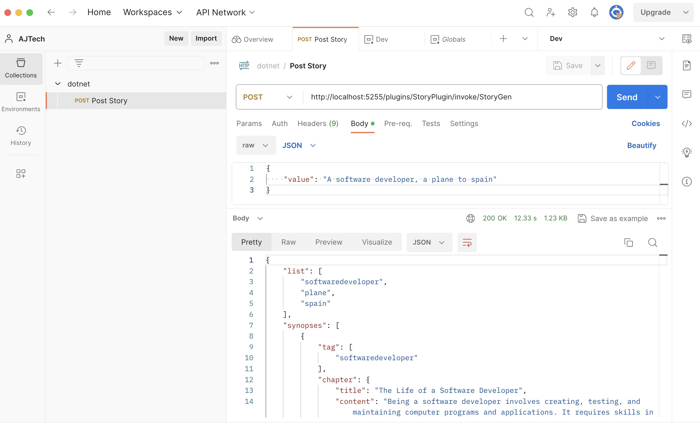

# semantic-kernel-dotnet-minimal-api

This is a minimal API in C# to demonstrate a Story generation plugin with Semantic Kernel integration.

## Prerequisites

- [.NET 8 SDK](https://dotnet.microsoft.com/download/dotnet/8.0) is required
- [C#](https://marketplace.visualstudio.com/items?itemName=ms-dotnettools.csharp)
- An OpenAI account and API key
- (Optional) An Azure subscription with OpenAI access
- Postman or other application to call the API

## Usage

Clone this Git repository to your local machine
Open the Solution in your desired IDE, e.g. Visual Studio Code, Visual Studio

Example:

